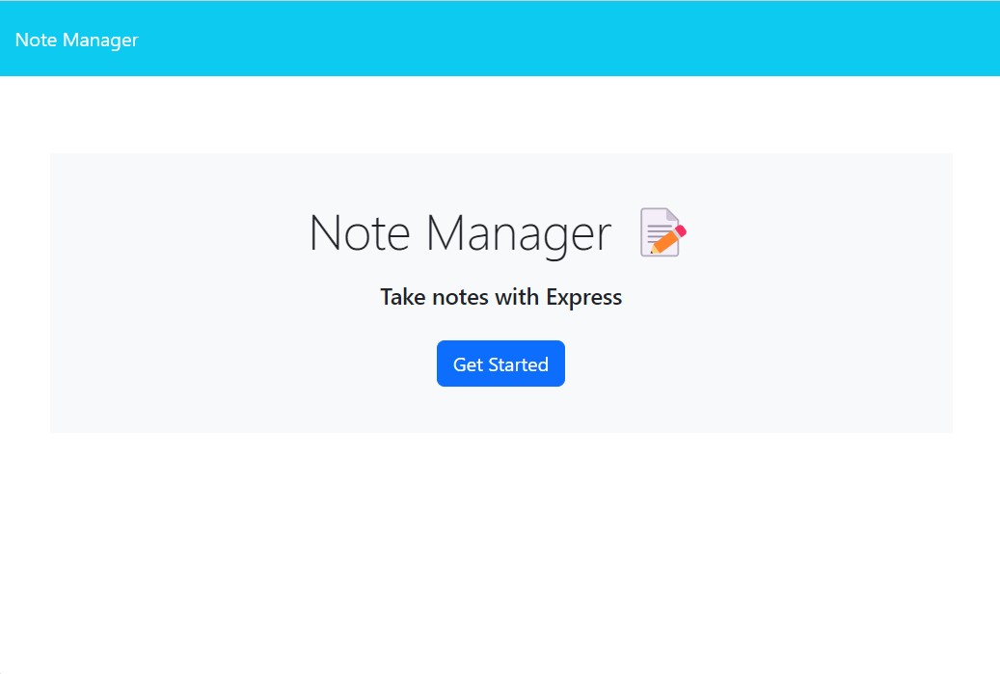
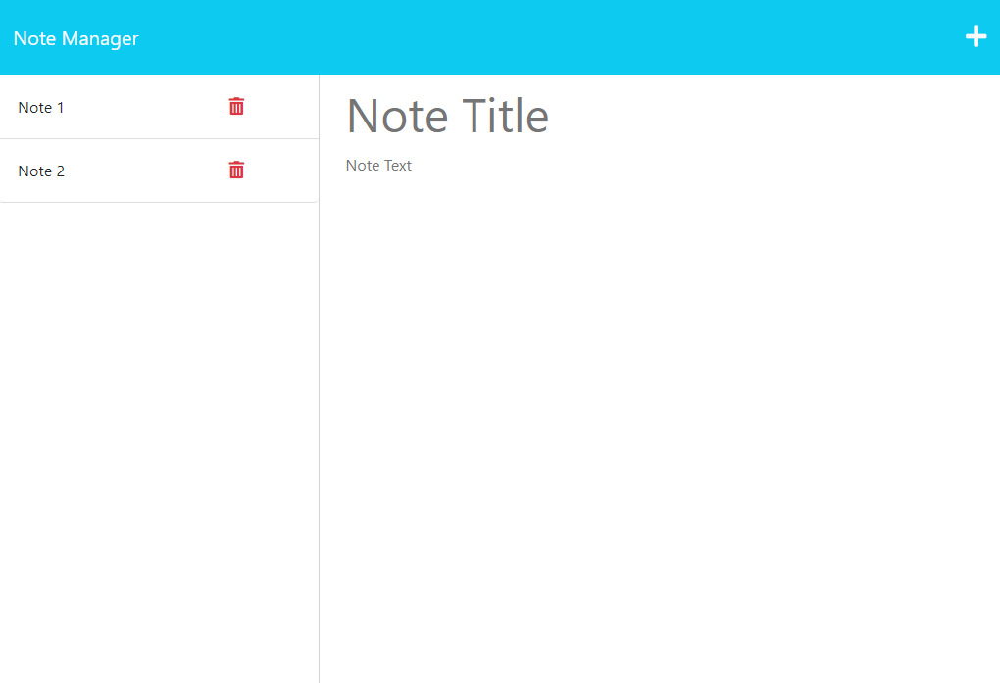

# Note Manager

## Note Manager
This repository was created to allow the users to create and manage their notes, and allows them to view and delete them when needed.

This project contain a few files that allows this web app to run and create and manage notes, this web app is based on nodeJS & nodeJS libraries that allow this web app to run and make it possible to run and get deployed live on Heroku web server.

This project is mainly focused on showing up my skills in JS and HTML with the integration of NodeJS libraries and improve on it as I progress my journey of learning full stack. 

The web app will store the note on db.json file that allow the user to retrieve and manage when required and then it display the notes on front end that is based on HTML.
## GitHub Repo URL
https://github.com/AllenHirmiz/Note-Manager

## Herohu Live Web URL
https://note-manager-app-08ae12656336.herokuapp.com/

## Table of Contents
Main page containing a button called "Get Started" to access note page
Note Page to view, add, manage and delete notes
Note Page contains the following:
    Add and Save button located to the top right corner of the website.
    Side panel that contain list of notes saved.
    Main section to view or add new notes.

## Installation
Web Based not installation required
## Technologies Used
Note Manager project is built using the following technologies:

JavaScript: Dynamic and interactive elements, such as animations and form validation.
NodeJS:
inquirer Library: 
express Library:
HTML
CSS

## Mock-Up

The following image shows the web application's appearance and functionality:

## Command line Screenshot
Main Page of the web app that contain a button called Git Started to redirect to the note page.

## Command line file example video
Note page that allows users to add, view, manage and delete notes
